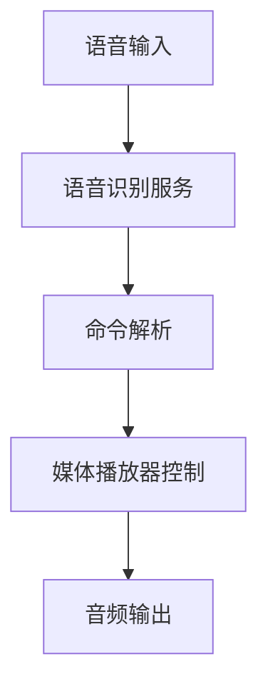

Flutter 任务卡片 TC-001

# 1. 基本信息
任务ID: TC-001
任务名称: 实现基础语音控制播放功能
优先级: P0
负责人: TBD

# 2. 任务上下文

## 2.1 业务背景
- 此功能是"器灵式交互体验"的基础模块，通过语音命令控制音频播放，为用户提供免手操作体验
- 主要应用于第二外语听力学习场景
- 作为系统的基础交互层，为后续教育功能提供交互基础

## 2.2 技术上下文


相关依赖模块：
- 语音识别服务
- 媒体播放器控制
- 命令解析器

# 3. 具体需求

## 3.1 功能需求

### 语音识别基础功能
1. 实现麦克风输入捕获
2. 支持语音识别服务配置（Google Speech-to-Text/Amazon Transcribe/Mozilla DeepSpeech）
3. 实现语音到文本的转换
4. 支持识别成功/失败的状态反馈

### 基础播放控制命令
1. 播放/暂停 - "播放"/"暂停"
2. 音量控制 - "调高音量"/"调低音量"
3. 快进/后退 - "快进"/"后退"
4. 下一个/上一个 - "下一个"/"上一个"

### 媒体播放器集成
1. 实现VLC或其他媒体播放器的API集成
2. 支持基本播放控制API调用
3. 播放状态同步与反馈

## 3.2 非功能需求

### 性能指标
- 语音识别响应时间 < 1秒
- 命令执行延迟 < 500ms
- CPU使用率峰值 < 30%
- 内存占用 < 100MB

### 可用性要求
- 支持在安静环境下95%以上的识别准确率
- 提供明确的语音识别状态反馈
- 支持基本的错误恢复机制

### 安全性要求
- 语音数据临时存储加密
- 遵循隐私保护规范
- 提供麦克风权限管理

# 4. TDD 方法

## 测试规划
1. 语音识别模块测试
   - 麦克风输入测试
   - 识别服务连接测试
   - 文本转换准确性测试
   
2. 命令解析测试
   - 基本命令识别测试
   - 错误命令处理测试
   
3. 播放器控制测试
   - API调用测试
   - 状态同步测试
   - 错误处理测试

# 5. 技术规范

## 5.1 接口定义

```dart
/// 语音识别服务接口
abstract class VoiceRecognitionService {
  Future<bool> initialize();
  Future<String> startListening();
  Future<void> stopListening();
  Stream<RecognitionState> get recognitionState;
}

/// 媒体播放器控制接口
abstract class MediaPlayerControl {
  Future<void> play();
  Future<void> pause();
  Future<void> setVolume(double volume);
  Future<void> seek(Duration position);
  Future<void> next();
  Future<void> previous();
  Stream<PlaybackState> get playbackState;
}

/// 命令解析器接口
abstract class CommandParser {
  Future<MediaCommand> parseCommand(String voiceInput);
}
```

## 5.2 状态定义

```dart
enum RecognitionState {
  idle,
  listening,
  processing,
  finished,
  error
}

enum PlaybackState {
  playing,
  paused,
  loading,
  error
}

enum MediaCommand {
  play,
  pause,
  volumeUp,
  volumeDown,
  seekForward,
  seekBackward,
  next,
  previous,
  unknown
}
```

# 6. 开发环境

## 6.1 环境要求
```json
{
  "flutter": ">=3.0.0",
  "dart": ">=2.17.0",
  "dependencies": {
    "speech_to_text": "^6.1.1",
    "just_audio": "^0.9.34",
    "provider": "^6.0.5"
  }
}
```

## 6.2 配置信息
```json
{
  "speech_recognition": {
    "service": "google",
    "timeout": 5000,
    "confidence_threshold": 0.8
  },
  "media_player": {
    "volume_step": 0.1,
    "seek_interval": 10
  }
}
```

# 7. 验收测试

## 7.1 单元测试用例

```dart
void main() {
  group('语音识别服务测试', () {
    late VoiceRecognitionService service;
    
    setUp(() {
      service = MockVoiceRecognitionService();
    });
    
    test('初始化测试', () async {
      expect(await service.initialize(), true);
    });
    
    test('识别状态流测试', () async {
      final states = [];
      service.recognitionState.listen(states.add);
      await service.startListening();
      expect(states, contains(RecognitionState.listening));
    });
  });
  
  group('命令解析测试', () {
    test('播放命令测试', () async {
      final parser = CommandParser();
      final command = await parser.parseCommand("播放");
      expect(command, equals(MediaCommand.play));
    });
  });
}
```

## 7.2 集成测试用例

```dart
void main() {
  IntegrationTestWidgetsFlutterBinding.ensureInitialized();

  group('语音控制集成测试', () {
    testWidgets('完整语音控制流程测试', (tester) async {
      await tester.pumpWidget(MyApp());
      
      // 模拟语音输入
      await tester.tap(find.byIcon(Icons.mic));
      await tester.pump();
      
      // 验证状态变化
      expect(find.byType(ListeningIndicator), findsOneWidget);
      
      // 验证命令执行
      expect(find.text('正在播放'), findsOneWidget);
    });
  });
}
```

# 8. 实现指南

## 8.1 实现步骤

1. 设置项目基础架构
   - 创建必要的目录结构
   - 配置依赖项
   
2. 实现语音识别服务
   - 集成选定的语音识别API
   - 实现状态管理
   
3. 实现命令解析器
   - 定义命令模式
   - 实现解析逻辑
   
4. 实现媒体播放器控制
   - 集成播放器API
   - 实现控制逻辑
   
5. 整合UI组件
   - 实现语音输入触发器
   - 添加状态指示器
   - 实现错误提示

# 9. 验收标准

## 9.1 功能验收
- 所有单元测试通过
- 集成测试通过
- 代码覆盖率 > 80%

## 9.2 性能验收
- 语音识别响应时间符合要求
- 内存占用在限制范围内
- CPU使用率符合要求

## 9.3 代码质量
- 通过Flutter分析器检查
- 符合项目代码规范
- 文档完整性检查通过

# 10. 注意事项

- 注意处理不同语音识别服务的特性差异
- 确保错误处理机制完善
- 考虑后续扩展性
- 注意音频播放状态同步问题

# 11. 参考资料

- [Google Speech-to-Text API文档](https://cloud.google.com/speech-to-text)
- [Flutter官方文档](https://flutter.dev/docs)
- [VLC媒体播放器API文档](https://www.videolan.org/developers/vlc/doc/doxygen/html/group__libvlc.html)
- [语音识别最佳实践指南](https://cloud.google.com/speech-to-text/docs/best-practices)